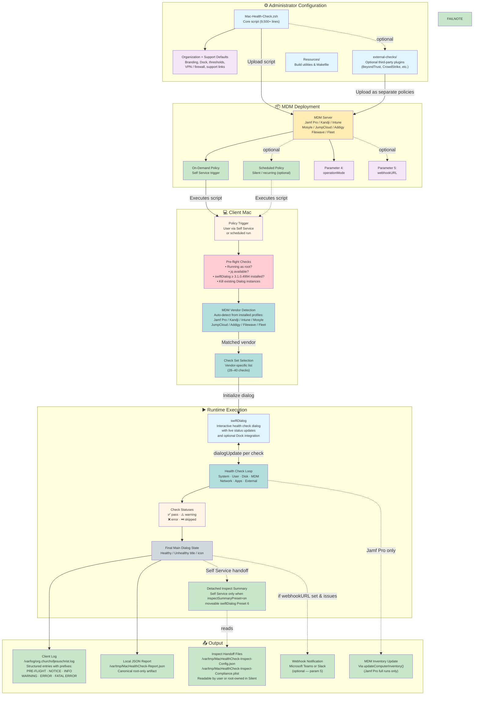

# Mac Health Check: System Architecture

This diagram shows the `4.0.0` Mac Health Check ecosystem, from administrator customization through MDM deployment, client-side execution, user interaction, and results output.

---

## Component Descriptions

### Administrator Configuration

**`Mac-Health-Check.zsh`**
The single deployable artifact (9,500+ lines). Contains the health check logic, swiftDialog UI layer, Dock handling, logging helpers, webhook delivery, and vendor-specific branching. Administrators typically customize the **Organization Variables** and **IT Support Variables** sections before uploading it to MDM.

**Organization + Support Defaults**
Key settings administrators configure before deployment:
- `organizationBrandingBannerURL` / `organizationOverlayiconURL` — Branding
- `enableDockIntegration` / `dockIcon` — Dock launch behavior and badge icon
- `vpnClientVendor` — VPN type (`paloalto`, `cisco`, `tailscale`, `none`)
- `organizationFirewall` — Firewall type (`socketfilterfw` or `pf`)
- `allowedMinimumFreeDiskPercentage` — Free disk threshold
- `allowedUptimeMinutes` — Uptime warning threshold
- `supportLabel1`–`supportLabel6` / `supportValue1`–`supportValue6` — Dynamic support lines and Info button target
- `completionTimer` — Dialog auto-close delay for the fallback countdown path

**`external-checks/`**
Optional plugin scripts for third-party tools (BeyondTrust, Cisco Umbrella, CrowdStrike Falcon, GlobalProtect). Each plugin is uploaded to MDM as a separate policy and writes results to a shared defaults domain (`organizationDefaultsDomain`) for the main script to read.

---

### MDM Deployment

Mac Health Check is MDM-agnostic and has been tested with eight MDM platforms. The script is uploaded as a policy script and executed with optional runtime and reporting parameters:

- **Parameter 4 (`operationMode`)** — Intended production default is `Self Service`; other supported modes are `Silent`, `Debug`, `Development`, and `Test`
- **Parameter 5 (`webhookURL`)** — Optional Microsoft Teams or Slack webhook URL used when runs with health issues need to post an issue summary
- **Parameters 6-10** — Optional Splunk reporting inputs for reporting mode, HEC URL, HEC token, HEC index, and HEC sourcetype
- **Parameter 11 (`forceFreshRun`)** — Optional one-shot Jamf override that bypasses cached Splunk upload shortcut and forces a complete fresh `Silent` health-check run

---

### Client Mac

**Pre-flight Checks**
The script validates its environment before running any health checks:
1. Confirms execution as root
2. Verifies `jq` is available for JSON validation and formatting; exits during pre-flight if it is missing
3. Checks for swiftDialog ≥ 3.1.0.4994, while avoiding redundant production downloads when the installed release already matches the latest production build
4. Kills any existing swiftDialog instances

**MDM Vendor Detection**
The script inspects installed configuration profiles to identify the MDM vendor, then selects the appropriate health check set (28–40 checks depending on vendor capabilities).

---

### Runtime Execution

Health checks execute sequentially, with each result posted to the swiftDialog dialog via a named pipe (`dialogUpdate`) in non-`Silent` modes and captured into a structured per-check result collector for final reporting. When Dock integration is enabled, non-`Silent` runs also show a Dock icon with a decreasing badge count. After all checks complete, the main dialog updates to its final healthy / needs attention / unhealthy state and writes a final JSON health report before cleanup. `Self Service` and full `Silent` health-check runs generate Inspect Mode config assets from the finalized in-memory results. In `Self Service`, a normal run also launches a detached, moveable Inspect Mode Preset 6 guided summary with separate `Unhealthy` and `Healthy` sections while the main dialog retains its standard countdown, and reruns can replay that cached summary without re-running checks when `inspectSummaryPreset="on"` and the handoff file is still younger than `inspectReplayMaximumAgeSeconds`. Client-Side Cache adds a client-side script and LaunchDaemon that refresh `/var/tmp/MacHealthCheck-Report.json` nightly, letting Jamf Pro upload a fresh cached report without repeating the checks when versions match unless operators explicitly force a full refresh.

---

### Output

**Client Log** — Every run writes structured log entries to `/var/log/org.churchofjesuschrist.log` using prefixed log levels (`[PRE-FLIGHT]`, `[NOTICE]`, `[INFO]`, `[WARNING]`, `[ERROR]`, `[FATAL ERROR]`). Logs include computer name, serial number, user, OS version, and all check results.

**JSON Report** — Every run writes the canonical report artifact to `/var/tmp/MacHealthCheck-Report.json` with root-only permissions. Optional Splunk HEC delivery wraps that same finalized report data rather than generating a second source of truth.

**Client-Side Cache** — Non-`Silent` and full Jamf production runs install `/Library/Management/org.churchofjesuschrist/MHC.zsh` plus `/Library/LaunchDaemons/org.churchofjesuschrist.MHC.plist`. The script validates the generated plist, loads it as a root LaunchDaemon without `RunAtLoad`, routes daemon stdout/stderr to `/dev/null`, and sets `launchDaemonRun=true` for scheduled executions. The LaunchDaemon starts at 00:53; the client-side copy applies deterministic hardware-derived jitter so runs land in the 00:53-01:53 window centered on 1:23 a.m. It runs in `Silent` mode with `splunkOperationMode=test`, refreshing the JSON report without storing Splunk secrets locally. If no GUI user is active during a LaunchDaemon refresh, user-scoped checks fall back to loginwindow `lastUserName`. Jamf `Silent` + `splunkOperationMode=production` normally uploads that cached JSON when the client/server versions match and the report is younger than 36 hours, but operators can bypass that shortcut with Parameter 11 `forceFreshRun=true` or `/var/tmp/MacHealthCheck-Force-Fresh-Run` to force a complete fresh run and overwrite the local report before Splunk delivery.

**Inspect Summary** — `Self Service` and full `Silent` health-check runs generate readable handoff files at `/var/tmp/MacHealthCheck-Inspect-Config.json` and `/var/tmp/MacHealthCheck-Inspect-Compliance.plist`. `Self Service` launches the detached, moveable Inspect Mode Preset 6 guided summary during the retained main-dialog countdown and can replay on rerun when `inspectSummaryPreset="on"` plus the cached handoff file remains younger than `inspectReplayMaximumAgeSeconds`. `Silent` writes the assets without launching swiftDialog. The summary now separates recorded results into `Unhealthy` and `Healthy` sections and omits either section when no checks were recorded in that bucket. Set the toggle to `off` to disable asset generation, launch and replay.

**Webhook** — When configured, a summary of warning, failed, or errored checks is posted to Microsoft Teams or Slack at the end of each run with health issues. Jamf Pro deployments include a direct link to the computer record.

**MDM Inventory** — Jamf Pro full check runs include `updateComputerInventory()` as the final Jamf-specific check. Jamf `Silent` + Splunk production runs and Client-Side Cache LaunchDaemon runs skip inventory submission.
