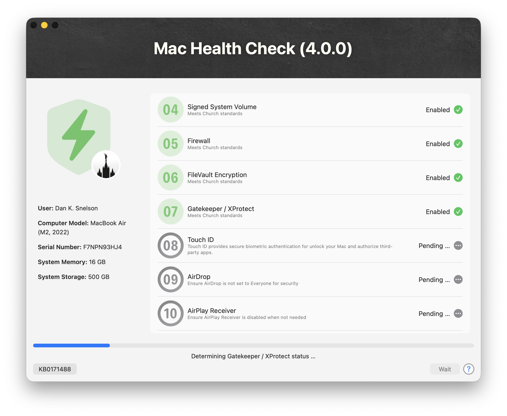

      [](https://swiftdialog.app) [](https://semgrep.dev)

# Mac Health Check (4.0.0)

> A **major** update to the practical, MDM-agnostic, user-friendly approach to surfacing Mac compliance information directly to end-users — and now **enterprise reporting data warehouses** — via your MDM's self-service app



<table>
    <tr>
        <td><a href="images/MHC_4.0.0.png"></a>Main Dialog</td>
        <td><a href="Resources/MacHealthCheck-Inspect-Mode/Screenshot%202026-06-23%20at%205.15.03%E2%80%AFPM.png"></a>Results Overview</td>
        <td><a href="Resources/MacHealthCheck-Inspect-Mode/Screenshot%202026-06-23%20at%205.15.58%E2%80%AFPM.png"></a>Security Status</td>
        <td><a href="Resources/MacHealthCheck-Inspect-Mode/Screenshot%202026-06-23%20at%205.16.02%E2%80%AFPM.png"></a>AirDrop Detail Sheet</td>
        <td><a href="Resources/MacHealthCheck-Inspect-Mode/Screenshot%202026-06-23%20at%205.16.19%E2%80%AFPM.png"></a>Bluetooth Sharing Detail Sheet</td>
    </tr>
    <tr>
        <td><a href="Resources/MacHealthCheck-Inspect-Mode/Screenshot%202026-06-23%20at%205.16.31%E2%80%AFPM.png"></a>Maintenance Status</td>
        <td><a href="Resources/MacHealthCheck-Inspect-Mode/Screenshot%202026-06-23%20at%205.16.36%E2%80%AFPM.png"></a>App Auto-Patch Detail Sheet</td>
        <td><a href="Resources/MacHealthCheck-Inspect-Mode/Screenshot%202026-06-23%20at%205.16.49%E2%80%AFPM.png"></a>Applications Status</td>
        <td><a href="Resources/MacHealthCheck-Inspect-Mode/Screenshot%202026-06-23%20at%205.16.57%E2%80%AFPM.png"></a>Homebrew Status Detail Sheet</td>
        <td><a href="Resources/MacHealthCheck-Inspect-Mode/Screenshot%202026-06-23%20at%205.17.56%E2%80%AFPM.png"></a>Next Steps</td>
    </tr>
</table>

## Overview

Mac Health Check provides a practical, MDM-agnostic, user-friendly approach to surfacing Mac compliance information directly to end-users via an MDM's Self Service.

Built using the open-source utility [swiftDialog](https://github.com/swiftDialog/swiftDialog/wiki), the solution acts as a “heads-up display” that presents real-time system health and policy compliance status in a clear and interactive format.

Deployment of Mac Health Check involves configuring organizational defaults, embedding the script in your MDM, creating a policy to run it on demand and testing to ensure proper output and behavior.

Administrators can customize the user interface using swiftDialog’s visual capabilities, making the experience both informative and approachable.

<a href="https://www.youtube.com/watch?v=rDPoYlSSEtQ&t=36s" target="_blank"><br />Rocketman Tech December 2025 Meetup</a> (05-Dec-2025)


## Use Cases

Mac Health Check is particularly valuable in IT support workflows, serving as an initial triage point for Tier 1 support by confirming network access, credentials, and MDM connectivity, while also acting as a verification tool for Tier 2 teams both during and after remediation efforts.

### :new: Enterprise Reporting

The tool logs results for review, writes a structured JSON health report locally, can optionally forward that report to Splunk HEC, and continues to avoid altering device configuration. In `Self Service`, `4.0.0` launches a detached swiftDialog Inspect Mode `preset6` guided summary built from finalized in-memory results plus a live compliance plist for swiftDialog `3.1.0.4994` compliance findings. The summary adds a remediation-first flow with `Quick Actions`, a conditional `Remediation Guide`, status-aware bento-grid cards, `compliance-summary`, `findings-list`, and the existing `Unhealthy` / `Healthy` details, while retaining the main dialog's 60-second completion countdown. Full `Silent` health-check runs generate the same Inspect Mode config and compliance plist artifacts without launching swiftDialog. Reruns within 15 minutes can replay that cached summary without re-running health checks, and runs with health issues rely on the final main-dialog state plus that detached inspect summary instead of a separate pseudo-alert notification.

- Structured JSON health report generated at the end of every run
- Local report saved to `/var/tmp/MacHealthCheck-Report.json` by default with `600` permissions
- Optional Splunk HEC delivery through Parameters 6-11 without changing the existing `operationMode` contract
- Parameters 9 and 10 set the HEC `index` and `sourcetype`; Parameter 11 enables reporting debug output
- `splunkOperationMode=off` disables HEC delivery explicitly while still preserving local JSON report generation
- `splunkOperationMode=test` preserves local report generation while intentionally skipping network transmission
- In `4.0.0`, non-`Silent` runs and full Jamf production runs install a client-side copy at `/Library/Management/org.churchofjesuschrist/MHC.zsh` plus a `org.churchofjesuschrist.MHC` LaunchDaemon that refreshes the local report across a deterministic 00:53-01:53 window centered on 1:23 a.m.
- The LaunchDaemon sets `launchDaemonRun=true`; the client-side script then derives a stable per-Mac jitter from hardware UUID, logs the jitter through MHC-prefixed logging, and routes daemon stdout/stderr to `/dev/null` to avoid duplicate client-log lines.
- When a LaunchDaemon-triggered refresh runs with no active GUI user, Mac Health Check falls back to `/Library/Preferences/com.apple.loginwindow.plist` `lastUserName` for user-scoped checks.
- Jamf Pro `Silent` + `splunkOperationMode=production` runs upload the cached report without re-running checks when the client-side script version matches and `/var/tmp/MacHealthCheck-Report.json` is valid and less than 36 hours old


See: [Resources/Splunk-Dashboard-Reference.md](Resources/Splunk-Dashboard-Reference.md) for copy/paste Splunk SPL, Simple XML, and Dashboard Studio starter examples.

### :new: End-user Reporting

The `inspectSummaryPreset` is now an `on` / `off` toggle: `on` generates the Preset 6 inspect-summary assets, launches the summary in `Self Service`, and enables cached replay; `off` disables asset generation, launch, and replay.

The current `4.0.0` beta targets swiftDialog `3.1.0.4994` or newer so `Self Service` can use the PR #684 Preset 6 spacing and highlight refinements. Until RC2 is published, the existing non-production fallback permits older compatible swiftDialog builds to render the same schema-valid config with their prior visual treatment. PR #684 also tolerates quoted scalar values from MDM templating tools; Mac Health Check continues to emit native JSON numbers and booleans.

User-facing report:

```zsh
dialog --inspect-mode --inspect-config /var/tmp/MacHealthCheck-Inspect-Config.json
```

Terminal summary of most recent health issues:

```zsh
jq -r '
    # Print overview text blocks (adapted from metadata + summary)
    "Mac Health Check Report",
    "Hostname: \(.metadata.hostname) (\(.metadata.localHostName))",
    "Timestamp: \(.metadata.timestamp)",
    "Overall Status: \(.summary.overallStatus)",
    "Healthy: \(.summary.healthyCount) | Warning: \(.summary.warningCount) | Fail: \(.summary.failCount)",
    "",

    # Then print unhealthy/warning summary + bullets
    (.checks[]
    | select(.status != "healthy")
    | if (.rawValue? | type) != "string" or .rawValue == ""
    then .message
    else "• \(.name): \(.rawValue)"
    end)
    ' /var/tmp/MacHealthCheck-Report.json
```

### Step Zero for Tier 1

- User has a working Internet connection
- User knows their directory credentials
- Mac can execute policies
- Validates Network Access Controls

### Step Ninety-nine for Tier 2

- Initial assessment for support sessions
- Easily confirms remediation efforts
- Provides peace-of-mind for end-users

### Silent Mode

- Silently performs all health checks and logs results
- No dialog is presented to the end-user
- Ideal for background compliance reporting
- Complements existing MDM compliance frameworks
- Full `Silent` health-check runs generate `/var/tmp/MacHealthCheck-Inspect-Config.json` and `/var/tmp/MacHealthCheck-Inspect-Compliance.plist` without launching swiftDialog
- When combined with `splunkOperationMode=production`, suppresses non-Splunk stdout/stderr noise in Jamf policy logs while continuing to write the full run to `${scriptLog}`
- In that same `Silent` + `splunkOperationMode=production` combination, `updateComputerInventory()` logs a skip message and does not run `jamf recon`
- Client-Side Cache uses a local LaunchDaemon copy to refresh `/var/tmp/MacHealthCheck-Report.json` nightly without storing Splunk HEC secrets client-side
- LaunchDaemon-triggered refreshes use the active console user when present, and otherwise fall back to loginwindow `lastUserName` for user-scoped checks
- Jamf Pro can then run `Silent` + `splunkOperationMode=production` to upload the cached report only when the client and server script versions match

#### Uninstall

```zsh
#!/bin/zsh --no-rcs

launchDaemonLabel="org.churchofjesuschrist.MHC"
launchDaemonPath="/Library/LaunchDaemons/${launchDaemonLabel}.plist"
organizationDirectory="/Library/Management/org.churchofjesuschrist"

# Stop/unload daemon:
/bin/launchctl bootout system "${launchDaemonPath}" 2>/dev/null || true
/bin/launchctl disable "system/${launchDaemonLabel}" 2>/dev/null || true

# Remove Client-Side Cache assets:
/bin/rm -fv "${launchDaemonPath}"
/bin/rm -rfv "${organizationDirectory}"

# Optional cached/report artifacts:
/bin/rm -fv /var/tmp/MacHealthCheck-Report.json
/bin/rm -fv /var/tmp/MacHealthCheck-Inspect-Config.json
/bin/rm -fv /var/tmp/MacHealthCheck-Inspect-Summary.log

# Optional log removal:
/bin/rm -fv /var/log/org.churchofjesuschrist.log
```

### Dock Integration

- Non-`Silent` modes launch swiftDialog with `--showdockicon` and `--dockicon`
- `dockIcon` is configurable and supports `default`, local paths, `file://` paths and `http(s)` URLs
- Mac Health Check copies `Dialog.app` to `/Library/Application Support/Dialog/${humanReadableScriptName}.app` and launches `dialogcli` from that bundle so Dock hover text matches the script name
- `dockiconbadge` shows the number of remaining checks, decreases after each completed check and is removed when checks complete
- If dock icon setup fails, Mac Health Check logs a warning and falls back to the default `/usr/local/bin/dialog` launch path

## Features
The following health checks and information reporting are included in version `4.0.0`, which operates in `Self Service` mode by default. (Change `operationMode` to `Debug`, `Development` or `Test` when getting ready to deploy in production.)

> :new: Mac Health Check version `4.0.0` retains secure JSON report generation and optional Splunk HEC delivery, adds Client-Side Cache nightly report caching for Jamf Pro Splunk uploads, updates Inspect Mode summary assets for swiftDialog `3.1.0.4994` PR #684 refinements, adds `Quick Actions`, a conditional `Remediation Guide`, status-aware 12-point bento-grid spacing, and a status-aware Overview highlight, writes those assets during full `Silent` health-check runs without launching UI, supports 15-minute cached summary replay on rerun, and retains `Wi-Fi Strength` plus warning-only final dialog handling via `Computer Needs Attention`.


### Health Checks

:tada: Improved in version `4.0.0`

1. macOS Version
1. Available Updates (including deferred and DDM-enforced updates)
1. System Integrity Protection
1. Signed System Volume (SSV)
1. Firewall
1. FileVault Encryption
1. Gatekeeper / XProtect
1. Touch ID
1. Password Hint
1. AirDrop
1. AirPlay Receiver
1. Bluetooth Sharing
1. VPN Client
1. Last Reboot
1. Free Disk Space
1. User's Directory Size and Item Count
    - Desktop
    - Downloads
    - Trash
1. MDM Profile
1. :new: Entra ID Registration
1. MDM Certificate Expiration
1. Apple Push Notification service
1. Jamf Pro Check-in
1. Jamf Pro Inventory
1. Extended Network Checks
    - Apple Push Notification Hosts
    - Apple Device Management
    - Apple Software and Carrier Updates
    - Apple Certificate Validation
    - Apple Identity and Content Services
    - Jamf Hosts
1. Wi-Fi Strength
1. App Auto-Patch
1. Homebrew Status
1. :tada: Electron Corner Mask [🔗](https://avarayr.github.io/shamelectron/)
1. Organizationally required Applications (i.e., Microsoft Teams)
1. BeyondTrust Privilege Management*
1. Cisco Umbrella*
1. CrowdStrike Falcon*
1. Palo Alto GlobalProtect*
1. Network Quality Test
1. Update Computer Inventory**

*Requires [external check](/external-checks/README.md)
**Requires Jamf Pro

Jamf Pro inventory submission is a final follow-up action. In full Jamf Pro runs, `updateComputerInventory()` now surfaces failed or timed-out `jamf recon` submissions to the end-user, and times out that submission after `90` seconds.

### Information Reporting


#### :new: JSON / Splunk Reporting
- Generates a structured JSON health report at the end of every run
- Saves the report locally to `/var/tmp/MacHealthCheck-Report.json` by default with `600` permissions
- Keeps `/var/tmp/MacHealthCheck-Report.json` as the canonical root-only report artifact
- Adds `identity.entraIDRegistration` with `status`, `method`, `lastUser`, `lastUserHome`, and `details`
- Supports optional Splunk HEC delivery through Parameters 6-11 without changing the existing `operationMode` contract
- Wraps the finalized report as `{sourcetype, index, event}` when posting to Splunk HEC
- Supports `splunkOperationMode=off` to disable HEC delivery explicitly while still preserving local JSON report generation
- Preserves local report generation in `splunkOperationMode=test` while intentionally skipping network transmission
- `Silent` plus `splunkOperationMode=production` mirrors only `Splunk Reporting:` lines to stdout; all other run output stays in `${scriptLog}`, and final exit returns success when local report generation plus HEC delivery both succeed, regardless of recorded health findings
- That `Silent` plus `splunkOperationMode=production` path also skips final Jamf Pro inventory submission while logging the skip to `${scriptLog}`
- Client-Side Cache avoids a full Jamf Pro health-check run when the client-side script at `/Library/Management/org.churchofjesuschrist/MHC.zsh` matches the server-side version and the cached JSON report is valid and fresh
- The client-side nightly run defaults to `operationMode="Silent"` and `splunkOperationMode="test"` so it updates the local report without sending to production Splunk, and its LaunchDaemon routes stdout/stderr to `/dev/null` so MHC-prefixed log writes are not duplicated
- Requires `jq` for JSON validation and formatting, with local report generation and Splunk payload assembly stopping at pre-flight if `jq` is unavailable
- Includes copy/paste Splunk SPL, Simple XML, and Dashboard Studio starter examples in [Resources/Splunk-Dashboard-Reference.md](Resources/Splunk-Dashboard-Reference.md)

#### :new: Inspect Mode Summary
- `Self Service` and full `Silent` health-check runs now generate `/var/tmp/MacHealthCheck-Inspect-Config.json` directly from finalized in-memory results
- `Self Service` and full `Silent` health-check runs also generate `/var/tmp/MacHealthCheck-Inspect-Compliance.plist`, which feeds `plistSources`, `compliance-summary`, `findings-list` and live-bound bento-grid popovers
- The generated config includes `/var/tmp/MacHealthCheck-Inspect.trigger`, `/var/tmp/MacHealthCheck-Inspect.ready` and `/var/tmp/MacHealthCheck-Inspect-Result.json` control paths for Inspect Mode workflows
- Unhealthy runs now surface `Quick Actions Recommended` in `Overview`, add a conditional `Remediation Guide` step immediately after `Overview`, and keep `Unhealthy` as the audit-detail step
- Category bento-grid cards now use status-aware backgrounds so unhealthy checks stand out more clearly in Preset 6, and `Available Updates` now expands across two columns when action is required
- Plist-backed bento cells now emit FR #667 detail-sheet fields (`severity`, `explanation`, `remediation`, `actionButtonText`, `actionURL`) so warning and failure cards can explain why action is needed and link directly to next steps
- Normal `Self Service` runs launch the detached swiftDialog Inspect Mode `preset6` guided summary after report generation while retaining the existing 60-second main-dialog countdown
- `Silent` runs never launch swiftDialog; they only write Inspect Mode config assets for later review
- The detached summary now separates recorded results into `Unhealthy` and `Healthy` sections and omits either section when no checks exist in that bucket
- Re-running `zsh Mac-Health-Check.zsh` within `inspectReplayMaximumAgeSeconds` (i.e., 15 minutes), replays the cached inspect summary immediately and skips the health checks plus the main dialog countdown
- `inspectSummaryPreset="on"` enables Preset 6 asset generation, `Self Service` launch and cached replay; set it to `off` to disable all three
- Unhealthy `Self Service` runs now rely on the final unhealthy main-dialog state plus the detached inspect summary after report generation, without a separate pseudo-alert notification
- If inspect-summary asset generation or launch fails, Mac Health Check falls back to the existing `completionTimer` countdown path
- Targets swiftDialog `3.1.0.4994` or newer for PR #684 rendering; older compatible builds retain their prior Preset 6 appearance

Example Preset 6 JSON fragments used by generated inspect assets:

```json
{
  "key": "available_updates",
  "displayName": "Available Updates",
  "category": "Maintenance",
  "isCritical": true,
  "severity": "warning",
  "explanation": "A macOS update is ready for this Mac. Installing current updates helps keep this Mac secure and aligned with Church standards.",
  "remediation": "1. Open **System Settings**.\n2. Select **General > Software Update**.\n3. Install **macOS 26.5 (19-May-2026)**.\n4. Restart your Mac if prompted.\n5. Run **Mac Health Check** again.",
  "actionButtonText": "Open Software Update",
  "actionURL": "x-apple.systempreferences:com.apple.Software-Update-Settings.extension"
}
```

```json
{
  "id": "support_resources",
  "column": 0,
  "row": 0,
  "columnSpan": 3,
  "title": "Help & Support",
  "subtitle": "Action Recommended",
  "sfSymbol": "person.crop.circle.badge.questionmark",
  "contentType": "mixed",
  "detailOverlay": {
    "title": "Help & Support",
    "subtitle": "Action Recommended",
    "icon": "SF=person.crop.circle.badge.questionmark",
    "content": [
      {
        "type": "info",
        "content": "Use these support options if you need help completing recommended steps."
      }
    ],
    "showSystemInfo": false,
    "showProgressInfo": false,
    "closeButtonText": "Close"
  }
}
```

#### IT Support
- Dynamic `supportLabel1` / `supportValue1` through `supportLabel6` / `supportValue6`
- Empty Label / Value pairs are skipped automatically
- Legacy fallback still works when all dynamic pairs are empty:
  - Telephone (`supportTeamPhone`)
  - Email (`supportTeamEmail`)
  - Website (`supportTeamWebsite`)
  - Knowledge Base Article (`supportKBURL`)
- Info button target now uses the first URL-like dynamic support value; if none is found, it falls back to legacy Knowledge Base values

#### User Information
- Full Name
- User Name
- User ID
- Volume Owners
- Secure Token
- Location Services
- Microsoft OneDrive Sync Date
- Platform Single Sign-on Extension

#### Computer Information
- macOS version (build)
- System Memory
- System Storage
- Dialog version
- Script version
- Computer Name
- Serial Number
- Wi-Fi SSID
- Wi-FI IP Address
- VPN IP Address

#### Jamf Pro Information**
- Site

***[Payload Variables for Configuration Profiles](https://learn.jamf.com/en-US/bundle/jamf-pro-documentation-11.18.0/page/Computer_Configuration_Profiles.html#ariaid-title2)

### Policy Log Reporting

```
MHC (4.0.0): 2026-05-09 03:43:13 - [NOTICE] WARNING: 'localadmin' IS A MEMBER OF 'admin';
User: macOS Server Administrator (localadmin) [503] staff everyone localaccounts _appserverusr 
admin _appserveradm com.apple.sharepoint.group.4 com.apple.sharepoint.group.3
com.apple.sharepoint.group.1 _appstore _lpadmin _lpoperator _developer _analyticsusers
com.apple.access_ftp com.apple.access_screensharing com.apple.access_ssh com.apple.access_remote_ae
com.apple.sharepoint.group.2; Bootstrap Token supported on server: YES;
Bootstrap Token escrowed to server: YES; sudo Check: /etc/sudoers: parsed OK;
sudoers: root  ALL = (ALL) ALL %admin  ALL = (ALL) ALL ; Platform SSOe: localadmin NOT logged in;
Location Services: Enabled; SSH: On; Microsoft OneDrive Sync Date: Not Configured;
Time Machine Backup Date: Not configured; localadmin's Desktop Size: 160M for 116 item(s);
localadmin's Trash Size: 1.8M for 3 item(s); Battery Cycle Count: 0; Wi-Fi: Liahona;
Ethernet IP address: 17.113.201.250; VPN IP: 17.113.201.250; 
Network Time Server: time.apple.com; Jamf Pro Computer ID: 007; Site: Servers
```

1. Warning when logged-in user is a member of `admin`
1. Deferred Software Updates
1. Logged-In User Group Membership
1. Security Mode
1. DEP-allowed MDM Control
1. Activation Lock
1. Bootstrap Token
1. sudoers
1. Kerberos SSOe
1. Location Services
1. SSH
1. Time Machine
1. Battery Cycle Count
1. Network Time Server
1. Jamf Pro Computer ID


## Support

<a href="https://slack.com/app_redirect?channel=C0977DRT7UY" target="_blank"></a>

Community-supplied, best-effort support is available on the [Mac Admins Slack](https://www.macadmins.org/) (free, registration required) [#mac-health-check Channel](https://slack.com/app_redirect?channel=C0977DRT7UY), or you can open an [issue](https://github.com/dan-snelson/Mac-Health-Check/issues).


## Deployment

<a href="https://snelson.us/mhc" target="_blank"></a><br />
Deployment of Mac Health Check involves configuring organizational defaults, uploading the script to your MDM server, creating a policy to run it on demand and testing to ensure proper output and behavior.

<a href="https://snelson.us/mhc" target="_blank">Continue reading …</a>


## Operation Mode: Development

A new "Development" Operation Mode has been added to aid in developing Health Checks, allowing quick runs against a small curated subset instead of the full suite.

When `operationMode` is set to `Development`, `4.0.0` uses a dedicated `developmentListitemJSON` for `AirDrop` plus `Wi-Fi Strength` instead of running the entire suite.

```zsh
####################################################################################################
#
# Program
#
####################################################################################################

# # # # # # # # # # # # # # # # # # # # # # # # # # # # # # # # # # # # # # # # # # # # # # # # # #
# Generate dialogJSONFile based on Operation Mode and MDM Vendor
# # # # # # # # # # # # # # # # # # # # # # # # # # # # # # # # # # # # # # # # # # # # # # # # # #

if [[ "${operationMode}" == "Development" ]]; then
    
    notice "Operation Mode is ${operationMode}; using ${operationMode} dialogJSONFile template."

    # Development List Items

    developmentListitemJSON='
    [
        {"title" : "Entra ID Registration", "subtitle" : "Checks Microsoft Entra registration for current user context", "icon" : "SF=19.circle,'"${organizationColorScheme}"'", "status" : "pending", "statustext" : "Pending …", "iconalpha" : 0.5}
    ]
    '
    # Validate developmentListitemJSON is valid JSON
    if ! validateJson "${developmentListitemJSON}"; then
        echo "Error: developmentListitemJSON is invalid JSON"
        echo "$developmentListitemJSON"
        exit 1
    else
        combinedJSON=$( mergeDialogAndListItems "${mainDialogJSON}" "${developmentListitemJSON}" )
    fi

else
```

Additionally, the matching Health Check functions are executed:

```zsh
# # # # # # # # # # # # # # # # # # # # # # # # # # # # # # # # # # # # # # # # # # # # # # # # # #
# Generate Health Checks based on Operation Mode and MDM Vendor (where "n" represents the listitem order)
# # # # # # # # # # # # # # # # # # # # # # # # # # # # # # # # # # # # # # # # # # # # # # # # # #

if [[ "${operationMode}" == "Development" ]]; then
    
    # Operation Mode: Development
    notice "Operation Mode is ${operationMode}; using ${operationMode}-specific Health Check."
    dialogUpdate "title: ${humanReadableScriptName} (${scriptVersion})<br>Operation Mode: ${operationMode}"
    # set -x
    checkEntraIDRegistration "0"
    # set +x

else
```
