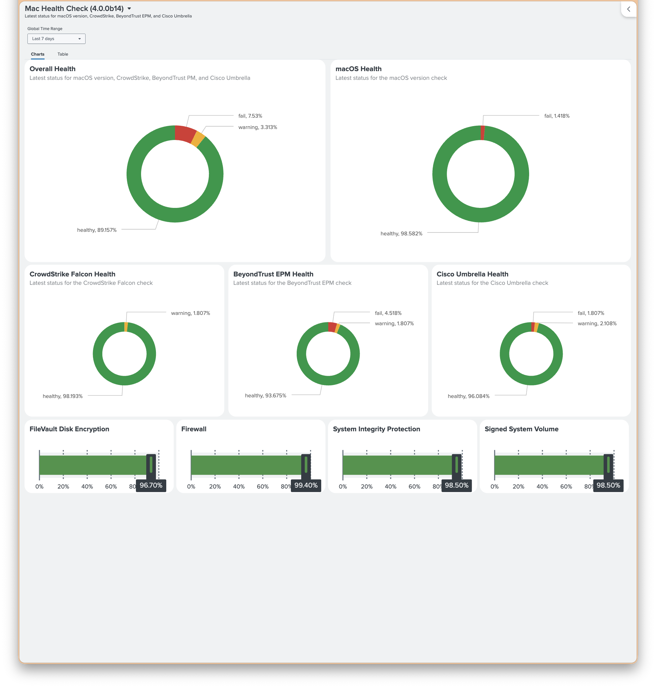

# Mac Health Check Splunk Dashboard Reference (4.0.0)

> 
>
> See: [Splunk Mac Health Check (4.0.0b26)_2026-05-15 at 10.11.21-0400_Splunk.json](Splunk%20Mac%20Health%20Check%20(4.0.0b26)_2026-05-15%20at%2010.11.21-0400_Splunk.json)

## Overview

This document describes actual sanitized Dashboard Studio definition in:

- `Resources/Splunk Mac Health Check (4.0.0b26)_2026-05-15 at 10.11.21-0400_Splunk.json`

Dashboard purpose:

- show latest reported Mac Health Check status per device
- focus primary compliance views on `macos_version`, `crowdstrike_falcon`, `beyondtrust_privilege_management`, and `cisco_umbrella`
- summarize additional platform controls with gauges for `filevault_encryption`, `firewall`, `system_integrity_protection`, and `signed_system_volume`
- provide chart-first tab plus detail table tab
- keep exported file safe for public sharing by using placeholder index value

## Sanitized Values

Public JSON intentionally uses:

- title: `Mac Health Check (4.0.0b26)`
- description: `Latest status for Macs: macOS version, CrowdStrike Falcon, BeyondTrust EPM and Cisco Umbrella`
- placeholder search root: `index=replace_with_your_index_prefix sourcetype=macHealthCheck`

Replace only index placeholder before import or after import. Sourcetype in current JSON already expects:

- `sourcetype=macHealthCheck`

## Dashboard Structure

Top-level configuration:

- input token: `global_time`
- default time range: `@d,now`
- default data source time binding: `$global_time.earliest$` and `$global_time.latest$`
- tabs: `Charts`, `Table`
- export visible: `hideExport: false`
- edit visible: `hideEdit: false`
- left navigation collapsed: `collapseNavigation: true`

### Tabs

`Charts` tab uses absolute layout with:

- `Overall Health` pie
- `macOS Health` pie
- `CrowdStrike Falcon Health` pie
- `BeyondTrust EPM Health` pie
- `Cisco Umbrella Health` pie
- `FileVault Disk Encryption` gauge
- `Firewall` gauge
- `System Integrity Protection` gauge
- `Signed System Volume` gauge

`Table` tab uses grid layout with:

- `Latest status for macOS version, CrowdStrike, BeyondTrust PM, and Cisco Umbrella`

## Visualization Map

| Visualization | Type | Data Source | Notes |
| --- | --- | --- | --- |
| `Overall Health` | `splunk.pie` | `ds_sqVYxkHb` | Buckets computed overall device status |
| `macOS Health` | `splunk.pie` | `ds_B0t8DYjx` | Only includes devices where `macOSBuild` is missing or does not end with letter |
| `CrowdStrike Falcon Health` | `splunk.pie` | `ds_27k2pPay` | Status distribution for `crowdstrike_falcon` |
| `BeyondTrust EPM Health` | `splunk.pie` | `ds_TBEpmQTc` | Status distribution for `beyondtrust_privilege_management` |
| `Cisco Umbrella Health` | `splunk.pie` | `ds_8Sraokuv` | Status distribution for `cisco_umbrella` |
| `FileVault Disk Encryption` | `splunk.fillergauge` | `ds_tGOKu1sU` | Percent healthy for `filevault_encryption` |
| `Firewall` | `splunk.fillergauge` | `ds_U9kDKnHI_ds_tGOKu1sU` | Percent healthy for `firewall` |
| `System Integrity Protection` | `splunk.fillergauge` | `ds_4LzUIOUD` | Percent healthy for `system_integrity_protection` |
| `Signed System Volume` | `splunk.fillergauge` | `ds_I21vxolY` | Percent healthy for `signed_system_volume` |
| `Latest status for macOS version, CrowdStrike, BeyondTrust PM, and Cisco Umbrella` | `splunk.table` | `ds_JSve2lfc` | One row per latest device report |

## Shared SPL Pattern

Most searches use same latest-device pattern:

```spl
index=replace_with_your_index_prefix sourcetype=macHealthCheck
| rename metadata.serialNumber AS serialNumber
| rename systemInfo.computerName AS computerName
| rename metadata.hostname AS hostname
| rename metadata.timestamp AS reportTimestamp
| rename summary.overallStatus AS reportedOverallStatus
| rename systemInfo.macOSBuild AS macOSBuild
| rename checks{}.key AS checkKey
| rename checks{}.status AS checkStatus
| eval deviceKey=coalesce(serialNumber, computerName, hostname)
| where isnotnull(deviceKey)
| sort 0 - _time
| dedup deviceKey
```

After dedup, dashboard searches branch into:

- per-check status distributions
- computed overall status distribution
- one-row detail table
- healthy percentage gauges for four additional controls

## Status Logic

Computed overall dashboard status does not trust only `summary.overallStatus`. It recalculates from four focused checks:

```spl
| eval overallStatus=case(
    macOSVersionStatus="fail" OR crowdstrikeFalconStatus="fail" OR beyondtrustPrivilegeManagementStatus="fail" OR ciscoUmbrellaStatus="fail", "fail",
    macOSVersionStatus="warning" OR crowdstrikeFalconStatus="warning" OR beyondtrustPrivilegeManagementStatus="warning" OR ciscoUmbrellaStatus="warning", "warning",
    true(), "healthy"
  )
| eval reportedOverallStatus=coalesce(reportedOverallStatus, "unknown")
```

Meaning:

- `Computed Overall` = dashboard recomputation from four focused checks
- `Reported Overall` = value emitted by report payload

Table and drilldowns show both values for comparison.

## Table Search

Table panel data source is `ds_JSve2lfc`. It returns one row per device with:

- `Latest Report`
- `Computed Overall`
- `Reported Overall`
- `Serial Number`
- `Computer Name`
- `Hostname`
- `macOS Build`
- `macOS Version`
- `CrowdStrike Falcon`
- `BeyondTrust PM`
- `Cisco Umbrella`

Important behavior:

- sorts `fail` before `warning`, then `healthy`
- uses `sampleRatio: 1`
- shows row numbers
- disables drilldown in table panel itself
- keeps internal fields hidden

## Drilldowns

All five pie charts use `drilldown.linkToSearch` and open new tab.

Drilldown targets:

- `Overall Health`: filters `where overallStatus="$row.overallStatus.value$"`
- `macOS Health`: filters `where macOSVersionStatus="$row.status.value$"`
- `CrowdStrike Falcon Health`: filters `where crowdstrikeFalconStatus="$row.status.value$"`
- `BeyondTrust EPM Health`: filters `where beyondtrustPrivilegeManagementStatus="$row.status.value$"`
- `Cisco Umbrella Health`: filters `where ciscoUmbrellaStatus="$row.status.value$"`

Drilldown result fields:

- `Latest Report`
- `Computed Overall`
- `Reported Overall`
- `Matching Check`
- `Serial Number`
- `Computer Name`
- `Hostname`
- `macOS Build`
- focused status columns

Overall drilldown builds `Matching Check` from all focused checks matching selected overall bucket.

## Gauge Searches

Four gauges return single field `healthyPct`:

- `filevault_encryption`
- `firewall`
- `system_integrity_protection`
- `signed_system_volume`

Pattern:

```spl
| eval status=coalesce(mvindex(checkStatus, mvfind(checkKey, "^filevault_encryption$")), "unknown")
| stats count as deviceCount sum(eval(status="healthy")) as healthyCount
| eval healthyPct=if(deviceCount>0, round((healthyCount/deviceCount)*100, 1), 0)
| fields healthyPct
```

All four gauges use:

- `gaugeColor: #53a051`
- `labelDisplay: percentage`
- `valueDisplay: percentage`
- `orientation: horizontal`

## Pie Chart Colors

Focused pie charts use same palette:

- `fail` -> `#D93F3C`
- `warning` -> `#F2B827`
- `healthy` -> `#2DA44E`
- `unknown` -> `#9AA5B1`

`Overall Health` omits explicit `unknown` color because search only emits `fail`, `warning`, or `healthy`.

## macOS Version Special Case

`macOS Health` search intentionally filters:

```spl
| where isnull(macOSBuild) OR NOT match(macOSBuild, "[A-Za-z]$")
```

This means chart excludes builds ending with letter suffix. Keep same logic unless you deliberately want macOS version panel to count those builds.

## Import and Customize

Recommended import flow:

1. Import JSON into Dashboard Studio.
2. Replace every `index=replace_with_your_index_prefix` with your Splunk index.
3. Confirm sourcetype really is `macHealthCheck` in your environment.
4. Verify raw events expose fields used by searches:
   - `metadata.serialNumber`
   - `systemInfo.computerName`
   - `metadata.hostname`
   - `metadata.timestamp`
   - `summary.overallStatus`
   - `systemInfo.macOSBuild`
   - `checks{}.key`
   - `checks{}.status`
5. Save dashboard.

If your environment wraps payload differently, update searches before save. Current JSON assumes those fields already search-extract correctly.

## Key Names Used

Focused checks:

- `macos_version`
- `crowdstrike_falcon`
- `beyondtrust_privilege_management`
- `cisco_umbrella`

Gauge checks:

- `filevault_encryption`
- `firewall`
- `system_integrity_protection`
- `signed_system_volume`

## Maintenance Notes

When dashboard JSON changes, update this document if any of these change:

- source filename
- title or description
- time token or default range
- tab names
- visualization titles
- check keys
- color mappings
- placeholder search root
- drilldown behavior

This file should describe shipped JSON, not aspirational dashboard ideas.
